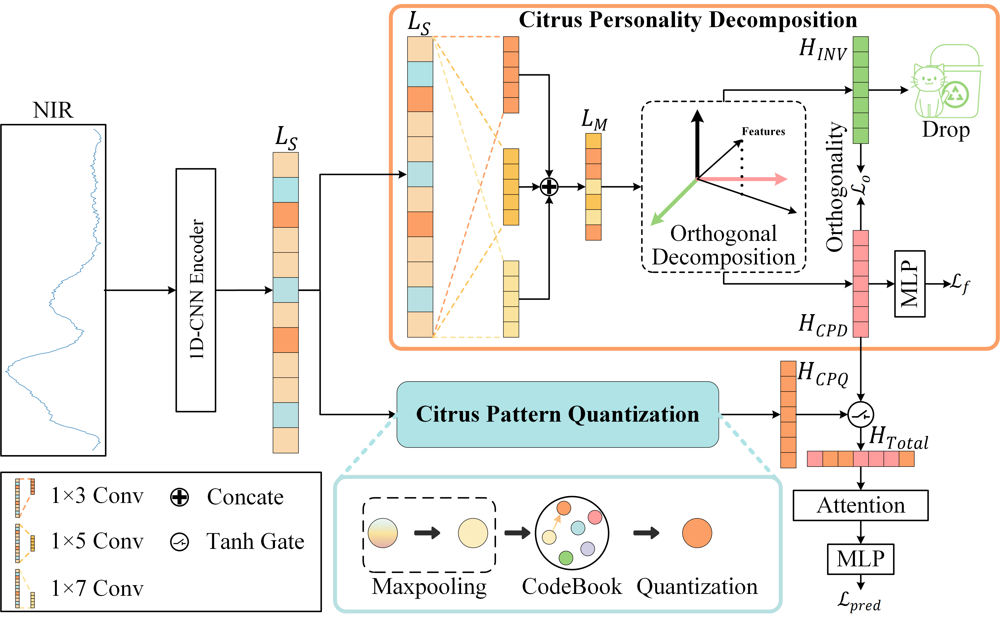

# PD-NIRL: Pattern Decoupling Based Near-Infrared Spectral Representation Learning for Citrus Identification!

Official implementation of PD-NIRL: Pattern Decoupling Based Near-Infrared Spectral Representation Learning for Citrus Identification!

  

